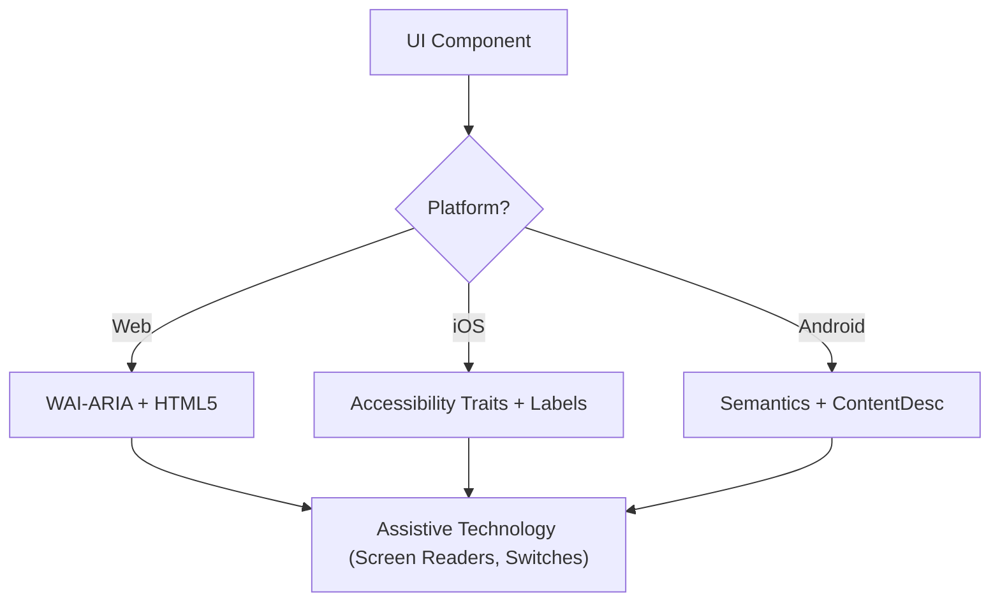

# CONTEXTO DE SKILLS INJETADAS PELO RAG

O RAG detectou que as seguintes diretrizes são vitais para a tarefa: "quero melhorar a interface meu meu app deixando mais moderno"

## ORIGEM: .rag\context\accessibility\SKILL.md
---
name: accessibility
description: Design, implement, and audit inclusive digital products using WCAG 2.2 Level AA
  standards. Use this skill to generate semantic ARIA for Web and accessibility traits for Web and Native platforms (iOS/Android).
origin: ECC
---

# Accessibility (WCAG 2.2)

This skill ensures that digital interfaces are Perceivable, Operable, Understandable, and Robust (POUR) for all users, including those using screen readers, switch controls, or keyboard navigation. It focuses on the technical implementation of WCAG 2.2 success criteria.

## When to Use

- Defining UI component specifications for Web, iOS, or Android.
- Auditing existing code for accessibility barriers or compliance gaps.
- Implementing new WCAG 2.2 standards like Target Size (Minimum) and Focus Appearance.
- Mapping high-level design requirements to technical attributes (ARIA roles, traits, hints).

## Core Concepts

- **POUR Principles**: The foundation of WCAG (Perceivable, Operable, Understandable, Robust).
- **Semantic Mapping**: Using native elements over generic containers to provide built-in accessibility.
- **Accessibility Tree**: The representation of the UI that assistive technologies actually "read."
- **Focus Management**: Controlling the order and visibility of the keyboard/screen reader cursor.
- **Labeling & Hints**: Providing context through `aria-label`, `accessibilityLabel`, and `contentDescription`.

## How It Works

### Step 1: Identify the Component Role

Determine the functional purpose (e.g., Is this a button, a link, or a tab?). Use the most semantic native element available before resorting to custom roles.

### Step 2: Define Perceivable Attributes

- Ensure text contrast meets **4.5:1** (normal) or **3:1** (large/UI).
- Add text alternatives for non-text content (images, icons).
- Implement responsive reflow (up to 400% zoom without loss of function).

### Step 3: Implement Operable Controls

- Ensure a minimum **24x24 CSS pixel** target size (WCAG 2.2 SC 2.5.8).
- Verify all interactive elements are reachable via keyboard and have a visible focus indicator (SC 2.4.11).
- Provide single-pointer alternatives for dragging movements.

### Step 4: Ensure Understandable Logic

- Use consistent navigation patterns.
- Provide descriptive error messages and suggestions for correction (SC 3.3.3).
- Implement "Redundant Entry" (SC 3.3.7) to prevent asking for the same data twice.

### Step 5: Verify Robust Compatibility

- Use correct `Name, Role, Value` patterns.
- Implement `aria-live` or live regions for dynamic status updates.

## Accessibility Architecture Diagram



## Cross-Platform Mapping

| Feature            | Web (HTML/ARIA)          | iOS (SwiftUI)                        | Android (Compose)                                           |
| :----------------- | :----------------------- | :----------------------------------- | :---------------------------------------------------------- |
| **Primary Label**  | `aria-label` / `<label>` | `.accessibilityLabel()`              | `contentDescription`                                        |
| **Secondary Hint** | `aria-describedby`       | `.accessibilityHint()`               | `Modifier.semantics { stateDescription = ... }`             |
| **Action Role**    | `role="button"`          | `.accessibilityAddTraits(.isButton)` | `Modifier.semantics { role = Role.Button }`                 |
| **Live Updates**   | `aria-live="polite"`     | `.accessibilityLiveRegion(.polite)`  | `Modifier.semantics { liveRegion = LiveRegionMode.Polite }` |

## Examples

### Web: Accessible Search

```html
<form role="search">
  <label for="search-input" class="sr-only">Search products</label>
  <input type="search" id="search-input" placeholder="Search..." />
  <button type="submit" aria-label="Submit Search">
    <svg aria-hidden="true">...</svg>
  </button>
</form>
```

### iOS: Accessible Action Button

```swift
Button(action: deleteItem) {
    Image(systemName: "trash")
}
.accessibilityLabel("Delete item")
.accessibilityHint("Permanently removes this item from your list")
.accessibilityAddTraits(.isButton)
```

### Android: Accessible Toggle

```kotlin
Switch(
    checked = isEnabled,
    onCheckedChange = { onToggle() },
    modifier = Modifier.semantics {
        contentDescription = "Enable notifications"
    }
)
```

## Anti-Patterns to Avoid

- **Div-Buttons**: Using a `<div>` or `<span>` for a click event without adding a role and keyboard support.
- **Color-Only Meaning**: Indicating an error or status _only_ with a color change (e.g., turning a border red).
- **Uncontained Modal Focus**: Modals that don't trap focus, allowing keyboard users to navigate background content while the modal is open. Focus must be contained _and_ escapable via the `Escape` key or an explicit close button (WCAG SC 2.1.2).
- **Redundant Alt Text**: Using "Image of..." or "Picture of..." in alt text (screen readers already announce the role "Image").

## Best Practices Checklist

- [ ] Interactive elements meet the **24x24px** (Web) or **44x44pt** (Native) target size.
- [ ] Focus indicators are clearly visible and high-contrast.
- [ ] Modals **contain focus** while open, and release it cleanly on close (`Escape` key or close button).
- [ ] Dropdowns and menus restore focus to the trigger element on close.
- [ ] Forms provide text-based error suggestions.
- [ ] All icon-only buttons have a descriptive text label.
- [ ] Content reflows properly when text is scaled.

## References

- [WCAG 2.2 Guidelines](https://www.w3.org/TR/WCAG22/)
- [WAI-ARIA Authoring Practices](https://www.w3.org/TR/wai-aria-practices/)
- [iOS Accessibility Programming Guide](https://developer.apple.com/documentation/accessibility)
- [iOS Human Interface Guidelines - Accessibility](https://developer.apple.com/design/human-interface-guidelines/accessibility)
- [Android Accessibility Developer Guide](https://developer.android.com/guide/topics/ui/accessibility)

## Related Skills

- `frontend-patterns`
- `frontend-design`
- `liquid-glass-design`
- `swiftui-patterns`


---

## ORIGEM: .rag\context\frontend-design\SKILL.md
---
name: frontend-design
description: Create distinctive, production-grade frontend interfaces with high design quality. Use when the user asks to build web components, pages, or applications and the visual direction matters as much as the code quality.
origin: ECC
---

# Frontend Design

Use this when the task is not just "make it work" but "make it look designed."

This skill is for product pages, dashboards, app shells, components, or visual systems that need a clear point of view instead of generic AI-looking UI.

## When To Use

- building a landing page, dashboard, or app surface from scratch
- upgrading a bland interface into something intentional and memorable
- translating a product concept into a concrete visual direction
- implementing a frontend where typography, composition, and motion matter

## Core Principle

Pick a direction and commit to it.

Safe-average UI is usually worse than a strong, coherent aesthetic with a few bold choices.

## Design Workflow

### 1. Frame the interface first

Before coding, settle:

- purpose
- audience
- emotional tone
- visual direction
- one thing the user should remember

Possible directions:

- brutally minimal
- editorial
- industrial
- luxury
- playful
- geometric
- retro-futurist
- soft and organic
- maximalist

Do not mix directions casually. Choose one and execute it cleanly.

### 2. Build the visual system

Define:

- type hierarchy
- color variables
- spacing rhythm
- layout logic
- motion rules
- surface / border / shadow treatment

Use CSS variables or the project's token system so the interface stays coherent as it grows.

### 3. Compose with intention

Prefer:

- asymmetry when it sharpens hierarchy
- overlap when it creates depth
- strong whitespace when it clarifies focus
- dense layouts only when the product benefits from density

Avoid defaulting to a symmetrical card grid unless it is clearly the right fit.

### 4. Make motion meaningful

Use animation to:

- reveal hierarchy
- stage information
- reinforce user action
- create one or two memorable moments

Do not scatter generic micro-interactions everywhere. One well-directed load sequence is usually stronger than twenty random hover effects.

## Strong Defaults

### Typography

- pick fonts with character
- pair a distinctive display face with a readable body face when appropriate
- avoid generic defaults when the page is design-led

### Color

- commit to a clear palette
- one dominant field with selective accents usually works better than evenly weighted rainbow palettes
- avoid cliché purple-gradient-on-white unless the product genuinely calls for it

### Background

Use atmosphere:

- gradients
- meshes
- textures
- subtle noise
- patterns
- layered transparency

Flat empty backgrounds are rarely the best answer for a product-facing page.

### Layout

- break the grid when the composition benefits from it
- use diagonals, offsets, and grouping intentionally
- keep reading flow obvious even when the layout is unconventional

## Anti-Patterns

Never default to:

- interchangeable SaaS hero sections
- generic card piles with no hierarchy
- random accent colors without a system
- placeholder-feeling typography
- motion that exists only because animation was easy to add

## Execution Rules

- preserve the established design system when working inside an existing product
- match technical complexity to the visual idea
- keep accessibility and responsiveness intact
- frontends should feel deliberate on desktop and mobile

## Quality Gate

Before delivering:

- the interface has a clear visual point of view
- typography and spacing feel intentional
- color and motion support the product instead of decorating it randomly
- the result does not read like generic AI UI
- the implementation is production-grade, not just visually interesting


---

## ORIGEM: .rag\context\tdd-workflow\SKILL.md
---
name: tdd-workflow
description: Use this skill when writing new features, fixing bugs, or refactoring code. Enforces test-driven development with 80%+ coverage including unit, integration, and E2E tests.
origin: ECC
---

# Test-Driven Development Workflow

This skill ensures all code development follows TDD principles with comprehensive test coverage.

## When to Activate

- Writing new features or functionality
- Fixing bugs or issues
- Refactoring existing code
- Adding API endpoints
- Creating new components

## Core Principles

### 1. Tests BEFORE Code
ALWAYS write tests first, then implement code to make tests pass.

### 2. Coverage Requirements
- Minimum 80% coverage (unit + integration + E2E)
- All edge cases covered
- Error scenarios tested
- Boundary conditions verified

### 3. Test Types

#### Unit Tests
- Individual functions and utilities
- Component logic
- Pure functions
- Helpers and utilities

#### Integration Tests
- API endpoints
- Database operations
- Service interactions
- External API calls

#### E2E Tests (Playwright)
- Critical user flows
- Complete workflows
- Browser automation
- UI interactions

### 4. Git Checkpoints
- If the repository is under Git, create a checkpoint commit after each TDD stage
- Do not squash or rewrite these checkpoint commits until the workflow is complete
- Each checkpoint commit message must describe the stage and the exact evidence captured
- Count only commits created on the current active branch for the current task
- Do not treat commits from other branches, earlier unrelated work, or distant branch history as valid checkpoint evidence
- Before treating a checkpoint as satisfied, verify that the commit is reachable from the current `HEAD` on the active branch and belongs to the current task sequence
- The preferred compact workflow is:
  - one commit for failing test added and RED validated
  - one commit for minimal fix applied and GREEN validated
  - one optional commit for refactor complete
- Separate evidence-only commits are not required if the test commit clearly corresponds to RED and the fix commit clearly corresponds to GREEN

## TDD Workflow Steps

### Step 1: Write User Journeys
```
As a [role], I want to [action], so that [benefit]

Example:
As a user, I want to search for markets semantically,
so that I can find relevant markets even without exact keywords.
```

### Step 2: Generate Test Cases
For each user journey, create comprehensive test cases:

```typescript
describe('Semantic Search', () => {
  it('returns relevant markets for query', async () => {
    // Test implementation
  })

  it('handles empty query gracefully', async () => {
    // Test edge case
  })

  it('falls back to substring search when Redis unavailable', async () => {
    // Test fallback behavior
  })

  it('sorts results by similarity score', async () => {
    // Test sorting logic
  })
})
```

### Step 3: Run Tests (They Should Fail)
```bash
npm test
# Tests should fail - we haven't implemented yet
```

This step is mandatory and is the RED gate for all production changes.

Before modifying business logic or other production code, you must verify a valid RED state via one of these paths:
- Runtime RED:
  - The relevant test target compiles successfully
  - The new or changed test is actually executed
  - The result is RED
- Compile-time RED:
  - The new test newly instantiates, references, or exercises the buggy code path
  - The compile failure is itself the intended RED signal
- In either case, the failure is caused by the intended business-logic bug, undefined behavior, or missing implementation
- The failure is not caused only by unrelated syntax errors, broken test setup, missing dependencies, or unrelated regressions

A test that was only written but not compiled and executed does not count as RED.

Do not edit production code until this RED state is confirmed.

If the repository is under Git, create a checkpoint commit immediately after this stage is validated.
Recommended commit message format:
- `test: add reproducer for <feature or bug>`
- This commit may also serve as the RED validation checkpoint if the reproducer was compiled and executed and failed for the intended reason
- Verify that this checkpoint commit is on the current active branch before continuing

### Step 4: Implement Code
Write minimal code to make tests pass:

```typescript
// Implementation guided by tests
export async function searchMarkets(query: string) {
  // Implementation here
}
```

If the repository is under Git, stage the minimal fix now but defer the checkpoint commit until GREEN is validated in Step 5.

### Step 5: Run Tests Again
```bash
npm test
# Tests should now pass
```

Rerun the same relevant test target after the fix and confirm the previously failing test is now GREEN.

Only after a valid GREEN result may you proceed to refactor.

If the repository is under Git, create a checkpoint commit immediately after GREEN is validated.
Recommended commit message format:
- `fix: <feature or bug>`
- The fix commit may also serve as the GREEN validation checkpoint if the same relevant test target was rerun and passed
- Verify that this checkpoint commit is on the current active branch before continuing

### Step 6: Refactor
Improve code quality while keeping tests green:
- Remove duplication
- Improve naming
- Optimize performance
- Enhance readability

If the repository is under Git, create a checkpoint commit immediately after refactoring is complete and tests remain green.
Recommended commit message format:
- `refactor: clean up after <feature or bug> implementation`
- Verify that this checkpoint commit is on the current active branch before considering the TDD cycle complete

### Step 7: Verify Coverage
```bash
npm run test:coverage
# Verify 80%+ coverage achieved
```

## Testing Patterns

### Unit Test Pattern (Jest/Vitest)
```typescript
import { render, screen, fireEvent } from '@testing-library/react'
import { Button } from './Button'

describe('Button Component', () => {
  it('renders with correct text', () => {
    render(<Button>Click me</Button>)
    expect(screen.getByText('Click me')).toBeInTheDocument()
  })

  it('calls onClick when clicked', () => {
    const handleClick = jest.fn()
    render(<Button onClick={handleClick}>Click</Button>)

    fireEvent.click(screen.getByRole('button'))

    expect(handleClick).toHaveBeenCalledTimes(1)
  })

  it('is disabled when disabled prop is true', () => {
    render(<Button disabled>Click</Button>)
    expect(screen.getByRole('button')).toBeDisabled()
  })
})
```

### API Integration Test Pattern
```typescript
import { NextRequest } from 'next/server'
import { GET } from './route'

describe('GET /api/markets', () => {
  it('returns markets successfully', async () => {
    const request = new NextRequest('http://localhost/api/markets')
    const response = await GET(request)
    const data = await response.json()

    expect(response.status).toBe(200)
    expect(data.success).toBe(true)
    expect(Array.isArray(data.data)).toBe(true)
  })

  it('validates query parameters', async () => {
    const request = new NextRequest('http://localhost/api/markets?limit=invalid')
    const response = await GET(request)

    expect(response.status).toBe(400)
  })

  it('handles database errors gracefully', async () => {
    // Mock database failure
    const request = new NextRequest('http://localhost/api/markets')
    // Test error handling
  })
})
```

### E2E Test Pattern (Playwright)
```typescript
import { test, expect } from '@playwright/test'

test('user can search and filter markets', async ({ page }) => {
  // Navigate to markets page
  await page.goto('/')
  await page.click('a[href="/markets"]')

  // Verify page loaded
  await expect(page.locator('h1')).toContainText('Markets')

  // Search for markets
  await page.fill('input[placeholder="Search markets"]', 'election')

  // Wait for debounce and results
  await page.waitForTimeout(600)

  // Verify search results displayed
  const results = page.locator('[data-testid="market-card"]')
  await expect(results).toHaveCount(5, { timeout: 5000 })

  // Verify results contain search term
  const firstResult = results.first()
  await expect(firstResult).toContainText('election', { ignoreCase: true })

  // Filter by status
  await page.click('button:has-text("Active")')

  // Verify filtered results
  await expect(results).toHaveCount(3)
})

test('user can create a new market', async ({ page }) => {
  // Login first
  await page.goto('/creator-dashboard')

  // Fill market creation form
  await page.fill('input[name="name"]', 'Test Market')
  await page.fill('textarea[name="description"]', 'Test description')
  await page.fill('input[name="endDate"]', '2025-12-31')

  // Submit form
  await page.click('button[type="submit"]')

  // Verify success message
  await expect(page.locator('text=Market created successfully')).toBeVisible()

  // Verify redirect to market page
  await expect(page).toHaveURL(/\/markets\/test-market/)
})
```

## Test File Organization

```
src/
├── components/
│   ├── Button/
│   │   ├── Button.tsx
│   │   ├── Button.test.tsx          # Unit tests
│   │   └── Button.stories.tsx       # Storybook
│   └── MarketCard/
│       ├── MarketCard.tsx
│       └── MarketCard.test.tsx
├── app/
│   └── api/
│       └── markets/
│           ├── route.ts
│           └── route.test.ts         # Integration tests
└── e2e/
    ├── markets.spec.ts               # E2E tests
    ├── trading.spec.ts
    └── auth.spec.ts
```

## Mocking External Services

### Supabase Mock
```typescript
jest.mock('@/lib/supabase', () => ({
  supabase: {
    from: jest.fn(() => ({
      select: jest.fn(() => ({
        eq: jest.fn(() => Promise.resolve({
          data: [{ id: 1, name: 'Test Market' }],
          error: null
        }))
      }))
    }))
  }
}))
```

### Redis Mock
```typescript
jest.mock('@/lib/redis', () => ({
  searchMarketsByVector: jest.fn(() => Promise.resolve([
    { slug: 'test-market', similarity_score: 0.95 }
  ])),
  checkRedisHealth: jest.fn(() => Promise.resolve({ connected: true }))
}))
```

### OpenAI Mock
```typescript
jest.mock('@/lib/openai', () => ({
  generateEmbedding: jest.fn(() => Promise.resolve(
    new Array(1536).fill(0.1) // Mock 1536-dim embedding
  ))
}))
```

## Test Coverage Verification

### Run Coverage Report
```bash
npm run test:coverage
```

### Coverage Thresholds
```json
{
  "jest": {
    "coverageThresholds": {
      "global": {
        "branches": 80,
        "functions": 80,
        "lines": 80,
        "statements": 80
      }
    }
  }
}
```

## Common Testing Mistakes to Avoid

### FAIL: WRONG: Testing Implementation Details
```typescript
// Don't test internal state
expect(component.state.count).toBe(5)
```

### PASS: CORRECT: Test User-Visible Behavior
```typescript
// Test what users see
expect(screen.getByText('Count: 5')).toBeInTheDocument()
```

### FAIL: WRONG: Brittle Selectors
```typescript
// Breaks easily
await page.click('.css-class-xyz')
```

### PASS: CORRECT: Semantic Selectors
```typescript
// Resilient to changes
await page.click('button:has-text("Submit")')
await page.click('[data-testid="submit-button"]')
```

### FAIL: WRONG: No Test Isolation
```typescript
// Tests depend on each other
test('creates user', () => { /* ... */ })
test('updates same user', () => { /* depends on previous test */ })
```

### PASS: CORRECT: Independent Tests
```typescript
// Each test sets up its own data
test('creates user', () => {
  const user = createTestUser()
  // Test logic
})

test('updates user', () => {
  const user = createTestUser()
  // Update logic
})
```

## Continuous Testing

### Watch Mode During Development
```bash
npm test -- --watch
# Tests run automatically on file changes
```

### Pre-Commit Hook
```bash
# Runs before every commit
npm test && npm run lint
```

### CI/CD Integration
```yaml
# GitHub Actions
- name: Run Tests
  run: npm test -- --coverage
- name: Upload Coverage
  uses: codecov/codecov-action@v3
```

## Best Practices

1. **Write Tests First** - Always TDD
2. **One Assert Per Test** - Focus on single behavior
3. **Descriptive Test Names** - Explain what's tested
4. **Arrange-Act-Assert** - Clear test structure
5. **Mock External Dependencies** - Isolate unit tests
6. **Test Edge Cases** - Null, undefined, empty, large
7. **Test Error Paths** - Not just happy paths
8. **Keep Tests Fast** - Unit tests < 50ms each
9. **Clean Up After Tests** - No side effects
10. **Review Coverage Reports** - Identify gaps

## Success Metrics

- 80%+ code coverage achieved
- All tests passing (green)
- No skipped or disabled tests
- Fast test execution (< 30s for unit tests)
- E2E tests cover critical user flows
- Tests catch bugs before production

---

**Remember**: Tests are not optional. They are the safety net that enables confident refactoring, rapid development, and production reliability.


---

