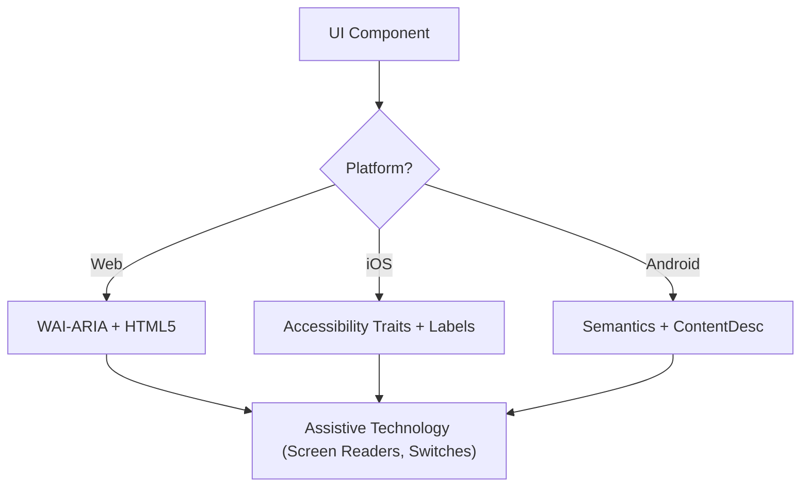

# CONTEXTO DE SKILLS INJETADAS PELO RAG

O RAG detectou que as seguintes diretrizes são vitais para a tarefa: "melhorar UI UX tela POS carrinho altura total desktop responsivo layout grid"

## ORIGEM: .rag\context\frontend-design\SKILL.md
---
name: frontend-design
description: Create distinctive, production-grade frontend interfaces with high design quality. Use when the user asks to build web components, pages, or applications and the visual direction matters as much as the code quality.
origin: ECC
---

# Frontend Design

Use this when the task is not just "make it work" but "make it look designed."

This skill is for product pages, dashboards, app shells, components, or visual systems that need a clear point of view instead of generic AI-looking UI.

## When To Use

- building a landing page, dashboard, or app surface from scratch
- upgrading a bland interface into something intentional and memorable
- translating a product concept into a concrete visual direction
- implementing a frontend where typography, composition, and motion matter

## Core Principle

Pick a direction and commit to it.

Safe-average UI is usually worse than a strong, coherent aesthetic with a few bold choices.

## Design Workflow

### 1. Frame the interface first

Before coding, settle:

- purpose
- audience
- emotional tone
- visual direction
- one thing the user should remember

Possible directions:

- brutally minimal
- editorial
- industrial
- luxury
- playful
- geometric
- retro-futurist
- soft and organic
- maximalist

Do not mix directions casually. Choose one and execute it cleanly.

### 2. Build the visual system

Define:

- type hierarchy
- color variables
- spacing rhythm
- layout logic
- motion rules
- surface / border / shadow treatment

Use CSS variables or the project's token system so the interface stays coherent as it grows.

### 3. Compose with intention

Prefer:

- asymmetry when it sharpens hierarchy
- overlap when it creates depth
- strong whitespace when it clarifies focus
- dense layouts only when the product benefits from density

Avoid defaulting to a symmetrical card grid unless it is clearly the right fit.

### 4. Make motion meaningful

Use animation to:

- reveal hierarchy
- stage information
- reinforce user action
- create one or two memorable moments

Do not scatter generic micro-interactions everywhere. One well-directed load sequence is usually stronger than twenty random hover effects.

## Strong Defaults

### Typography

- pick fonts with character
- pair a distinctive display face with a readable body face when appropriate
- avoid generic defaults when the page is design-led

### Color

- commit to a clear palette
- one dominant field with selective accents usually works better than evenly weighted rainbow palettes
- avoid cliché purple-gradient-on-white unless the product genuinely calls for it

### Background

Use atmosphere:

- gradients
- meshes
- textures
- subtle noise
- patterns
- layered transparency

Flat empty backgrounds are rarely the best answer for a product-facing page.

### Layout

- break the grid when the composition benefits from it
- use diagonals, offsets, and grouping intentionally
- keep reading flow obvious even when the layout is unconventional

## Anti-Patterns

Never default to:

- interchangeable SaaS hero sections
- generic card piles with no hierarchy
- random accent colors without a system
- placeholder-feeling typography
- motion that exists only because animation was easy to add

## Execution Rules

- preserve the established design system when working inside an existing product
- match technical complexity to the visual idea
- keep accessibility and responsiveness intact
- frontends should feel deliberate on desktop and mobile

## Quality Gate

Before delivering:

- the interface has a clear visual point of view
- typography and spacing feel intentional
- color and motion support the product instead of decorating it randomly
- the result does not read like generic AI UI
- the implementation is production-grade, not just visually interesting


---

## ORIGEM: .rag\context\frontend-patterns\SKILL.md
---
name: frontend-patterns
description: Frontend development patterns for React, Next.js, state management, performance optimization, and UI best practices.
origin: ECC
---

# Frontend Development Patterns

Modern frontend patterns for React, Next.js, and performant user interfaces.

## When to Activate

- Building React components (composition, props, rendering)
- Managing state (useState, useReducer, Zustand, Context)
- Implementing data fetching (SWR, React Query, server components)
- Optimizing performance (memoization, virtualization, code splitting)
- Working with forms (validation, controlled inputs, Zod schemas)
- Handling client-side routing and navigation
- Building accessible, responsive UI patterns

## Component Patterns

### Composition Over Inheritance

```typescript
// PASS: GOOD: Component composition
interface CardProps {
  children: React.ReactNode
  variant?: 'default' | 'outlined'
}

export function Card({ children, variant = 'default' }: CardProps) {
  return <div className={`card card-${variant}`}>{children}</div>
}

export function CardHeader({ children }: { children: React.ReactNode }) {
  return <div className="card-header">{children}</div>
}

export function CardBody({ children }: { children: React.ReactNode }) {
  return <div className="card-body">{children}</div>
}

// Usage
<Card>
  <CardHeader>Title</CardHeader>
  <CardBody>Content</CardBody>
</Card>
```

### Compound Components

```typescript
interface TabsContextValue {
  activeTab: string
  setActiveTab: (tab: string) => void
}

const TabsContext = createContext<TabsContextValue | undefined>(undefined)

export function Tabs({ children, defaultTab }: {
  children: React.ReactNode
  defaultTab: string
}) {
  const [activeTab, setActiveTab] = useState(defaultTab)

  return (
    <TabsContext.Provider value={{ activeTab, setActiveTab }}>
      {children}
    </TabsContext.Provider>
  )
}

export function TabList({ children }: { children: React.ReactNode }) {
  return <div className="tab-list">{children}</div>
}

export function Tab({ id, children }: { id: string, children: React.ReactNode }) {
  const context = useContext(TabsContext)
  if (!context) throw new Error('Tab must be used within Tabs')

  return (
    <button
      className={context.activeTab === id ? 'active' : ''}
      onClick={() => context.setActiveTab(id)}
    >
      {children}
    </button>
  )
}

// Usage
<Tabs defaultTab="overview">
  <TabList>
    <Tab id="overview">Overview</Tab>
    <Tab id="details">Details</Tab>
  </TabList>
</Tabs>
```

### Render Props Pattern

```typescript
interface DataLoaderProps<T> {
  url: string
  children: (data: T | null, loading: boolean, error: Error | null) => React.ReactNode
}

export function DataLoader<T>({ url, children }: DataLoaderProps<T>) {
  const [data, setData] = useState<T | null>(null)
  const [loading, setLoading] = useState(true)
  const [error, setError] = useState<Error | null>(null)

  useEffect(() => {
    fetch(url)
      .then(res => res.json())
      .then(setData)
      .catch(setError)
      .finally(() => setLoading(false))
  }, [url])

  return <>{children(data, loading, error)}</>
}

// Usage
<DataLoader<Market[]> url="/api/markets">
  {(markets, loading, error) => {
    if (loading) return <Spinner />
    if (error) return <Error error={error} />
    return <MarketList markets={markets!} />
  }}
</DataLoader>
```

## Custom Hooks Patterns

### State Management Hook

```typescript
export function useToggle(initialValue = false): [boolean, () => void] {
  const [value, setValue] = useState(initialValue)

  const toggle = useCallback(() => {
    setValue(v => !v)
  }, [])

  return [value, toggle]
}

// Usage
const [isOpen, toggleOpen] = useToggle()
```

### Async Data Fetching Hook

```typescript
interface UseQueryOptions<T> {
  onSuccess?: (data: T) => void
  onError?: (error: Error) => void
  enabled?: boolean
}

export function useQuery<T>(
  key: string,
  fetcher: () => Promise<T>,
  options?: UseQueryOptions<T>
) {
  const [data, setData] = useState<T | null>(null)
  const [error, setError] = useState<Error | null>(null)
  const [loading, setLoading] = useState(false)

  const refetch = useCallback(async () => {
    setLoading(true)
    setError(null)

    try {
      const result = await fetcher()
      setData(result)
      options?.onSuccess?.(result)
    } catch (err) {
      const error = err as Error
      setError(error)
      options?.onError?.(error)
    } finally {
      setLoading(false)
    }
  }, [fetcher, options])

  useEffect(() => {
    if (options?.enabled !== false) {
      refetch()
    }
  }, [key, refetch, options?.enabled])

  return { data, error, loading, refetch }
}

// Usage
const { data: markets, loading, error, refetch } = useQuery(
  'markets',
  () => fetch('/api/markets').then(r => r.json()),
  {
    onSuccess: data => console.log('Fetched', data.length, 'markets'),
    onError: err => console.error('Failed:', err)
  }
)
```

### Debounce Hook

```typescript
export function useDebounce<T>(value: T, delay: number): T {
  const [debouncedValue, setDebouncedValue] = useState<T>(value)

  useEffect(() => {
    const handler = setTimeout(() => {
      setDebouncedValue(value)
    }, delay)

    return () => clearTimeout(handler)
  }, [value, delay])

  return debouncedValue
}

// Usage
const [searchQuery, setSearchQuery] = useState('')
const debouncedQuery = useDebounce(searchQuery, 500)

useEffect(() => {
  if (debouncedQuery) {
    performSearch(debouncedQuery)
  }
}, [debouncedQuery])
```

## State Management Patterns

### Context + Reducer Pattern

```typescript
interface State {
  markets: Market[]
  selectedMarket: Market | null
  loading: boolean
}

type Action =
  | { type: 'SET_MARKETS'; payload: Market[] }
  | { type: 'SELECT_MARKET'; payload: Market }
  | { type: 'SET_LOADING'; payload: boolean }

function reducer(state: State, action: Action): State {
  switch (action.type) {
    case 'SET_MARKETS':
      return { ...state, markets: action.payload }
    case 'SELECT_MARKET':
      return { ...state, selectedMarket: action.payload }
    case 'SET_LOADING':
      return { ...state, loading: action.payload }
    default:
      return state
  }
}

const MarketContext = createContext<{
  state: State
  dispatch: Dispatch<Action>
} | undefined>(undefined)

export function MarketProvider({ children }: { children: React.ReactNode }) {
  const [state, dispatch] = useReducer(reducer, {
    markets: [],
    selectedMarket: null,
    loading: false
  })

  return (
    <MarketContext.Provider value={{ state, dispatch }}>
      {children}
    </MarketContext.Provider>
  )
}

export function useMarkets() {
  const context = useContext(MarketContext)
  if (!context) throw new Error('useMarkets must be used within MarketProvider')
  return context
}
```

## Performance Optimization

### Memoization

```typescript
// PASS: useMemo for expensive computations
const sortedMarkets = useMemo(() => {
  return markets.sort((a, b) => b.volume - a.volume)
}, [markets])

// PASS: useCallback for functions passed to children
const handleSearch = useCallback((query: string) => {
  setSearchQuery(query)
}, [])

// PASS: React.memo for pure components
export const MarketCard = React.memo<MarketCardProps>(({ market }) => {
  return (
    <div className="market-card">
      <h3>{market.name}</h3>
      <p>{market.description}</p>
    </div>
  )
})
```

### Code Splitting & Lazy Loading

```typescript
import { lazy, Suspense } from 'react'

// PASS: Lazy load heavy components
const HeavyChart = lazy(() => import('./HeavyChart'))
const ThreeJsBackground = lazy(() => import('./ThreeJsBackground'))

export function Dashboard() {
  return (
    <div>
      <Suspense fallback={<ChartSkeleton />}>
        <HeavyChart data={data} />
      </Suspense>

      <Suspense fallback={null}>
        <ThreeJsBackground />
      </Suspense>
    </div>
  )
}
```

### Virtualization for Long Lists

```typescript
import { useVirtualizer } from '@tanstack/react-virtual'

export function VirtualMarketList({ markets }: { markets: Market[] }) {
  const parentRef = useRef<HTMLDivElement>(null)

  const virtualizer = useVirtualizer({
    count: markets.length,
    getScrollElement: () => parentRef.current,
    estimateSize: () => 100,  // Estimated row height
    overscan: 5  // Extra items to render
  })

  return (
    <div ref={parentRef} style={{ height: '600px', overflow: 'auto' }}>
      <div
        style={{
          height: `${virtualizer.getTotalSize()}px`,
          position: 'relative'
        }}
      >
        {virtualizer.getVirtualItems().map(virtualRow => (
          <div
            key={virtualRow.index}
            style={{
              position: 'absolute',
              top: 0,
              left: 0,
              width: '100%',
              height: `${virtualRow.size}px`,
              transform: `translateY(${virtualRow.start}px)`
            }}
          >
            <MarketCard market={markets[virtualRow.index]} />
          </div>
        ))}
      </div>
    </div>
  )
}
```

## Form Handling Patterns

### Controlled Form with Validation

```typescript
interface FormData {
  name: string
  description: string
  endDate: string
}

interface FormErrors {
  name?: string
  description?: string
  endDate?: string
}

export function CreateMarketForm() {
  const [formData, setFormData] = useState<FormData>({
    name: '',
    description: '',
    endDate: ''
  })

  const [errors, setErrors] = useState<FormErrors>({})

  const validate = (): boolean => {
    const newErrors: FormErrors = {}

    if (!formData.name.trim()) {
      newErrors.name = 'Name is required'
    } else if (formData.name.length > 200) {
      newErrors.name = 'Name must be under 200 characters'
    }

    if (!formData.description.trim()) {
      newErrors.description = 'Description is required'
    }

    if (!formData.endDate) {
      newErrors.endDate = 'End date is required'
    }

    setErrors(newErrors)
    return Object.keys(newErrors).length === 0
  }

  const handleSubmit = async (e: React.FormEvent) => {
    e.preventDefault()

    if (!validate()) return

    try {
      await createMarket(formData)
      // Success handling
    } catch (error) {
      // Error handling
    }
  }

  return (
    <form onSubmit={handleSubmit}>
      <input
        value={formData.name}
        onChange={e => setFormData(prev => ({ ...prev, name: e.target.value }))}
        placeholder="Market name"
      />
      {errors.name && <span className="error">{errors.name}</span>}

      {/* Other fields */}

      <button type="submit">Create Market</button>
    </form>
  )
}
```

## Error Boundary Pattern

```typescript
interface ErrorBoundaryState {
  hasError: boolean
  error: Error | null
}

export class ErrorBoundary extends React.Component<
  { children: React.ReactNode },
  ErrorBoundaryState
> {
  state: ErrorBoundaryState = {
    hasError: false,
    error: null
  }

  static getDerivedStateFromError(error: Error): ErrorBoundaryState {
    return { hasError: true, error }
  }

  componentDidCatch(error: Error, errorInfo: React.ErrorInfo) {
    console.error('Error boundary caught:', error, errorInfo)
  }

  render() {
    if (this.state.hasError) {
      return (
        <div className="error-fallback">
          <h2>Something went wrong</h2>
          <p>{this.state.error?.message}</p>
          <button onClick={() => this.setState({ hasError: false })}>
            Try again
          </button>
        </div>
      )
    }

    return this.props.children
  }
}

// Usage
<ErrorBoundary>
  <App />
</ErrorBoundary>
```

## Animation Patterns

### Framer Motion Animations

```typescript
import { motion, AnimatePresence } from 'framer-motion'

// PASS: List animations
export function AnimatedMarketList({ markets }: { markets: Market[] }) {
  return (
    <AnimatePresence>
      {markets.map(market => (
        <motion.div
          key={market.id}
          initial={{ opacity: 0, y: 20 }}
          animate={{ opacity: 1, y: 0 }}
          exit={{ opacity: 0, y: -20 }}
          transition={{ duration: 0.3 }}
        >
          <MarketCard market={market} />
        </motion.div>
      ))}
    </AnimatePresence>
  )
}

// PASS: Modal animations
export function Modal({ isOpen, onClose, children }: ModalProps) {
  return (
    <AnimatePresence>
      {isOpen && (
        <>
          <motion.div
            className="modal-overlay"
            initial={{ opacity: 0 }}
            animate={{ opacity: 1 }}
            exit={{ opacity: 0 }}
            onClick={onClose}
          />
          <motion.div
            className="modal-content"
            initial={{ opacity: 0, scale: 0.9, y: 20 }}
            animate={{ opacity: 1, scale: 1, y: 0 }}
            exit={{ opacity: 0, scale: 0.9, y: 20 }}
          >
            {children}
          </motion.div>
        </>
      )}
    </AnimatePresence>
  )
}
```

## Accessibility Patterns

### Keyboard Navigation

```typescript
export function Dropdown({ options, onSelect }: DropdownProps) {
  const [isOpen, setIsOpen] = useState(false)
  const [activeIndex, setActiveIndex] = useState(0)

  const handleKeyDown = (e: React.KeyboardEvent) => {
    switch (e.key) {
      case 'ArrowDown':
        e.preventDefault()
        setActiveIndex(i => Math.min(i + 1, options.length - 1))
        break
      case 'ArrowUp':
        e.preventDefault()
        setActiveIndex(i => Math.max(i - 1, 0))
        break
      case 'Enter':
        e.preventDefault()
        onSelect(options[activeIndex])
        setIsOpen(false)
        break
      case 'Escape':
        setIsOpen(false)
        break
    }
  }

  return (
    <div
      role="combobox"
      aria-expanded={isOpen}
      aria-haspopup="listbox"
      onKeyDown={handleKeyDown}
    >
      {/* Dropdown implementation */}
    </div>
  )
}
```

### Focus Management

```typescript
export function Modal({ isOpen, onClose, children }: ModalProps) {
  const modalRef = useRef<HTMLDivElement>(null)
  const previousFocusRef = useRef<HTMLElement | null>(null)

  useEffect(() => {
    if (isOpen) {
      // Save currently focused element
      previousFocusRef.current = document.activeElement as HTMLElement

      // Focus modal
      modalRef.current?.focus()
    } else {
      // Restore focus when closing
      previousFocusRef.current?.focus()
    }
  }, [isOpen])

  return isOpen ? (
    <div
      ref={modalRef}
      role="dialog"
      aria-modal="true"
      tabIndex={-1}
      onKeyDown={e => e.key === 'Escape' && onClose()}
    >
      {children}
    </div>
  ) : null
}
```

**Remember**: Modern frontend patterns enable maintainable, performant user interfaces. Choose patterns that fit your project complexity.


---

## ORIGEM: .rag\context\accessibility\SKILL.md
---
name: accessibility
description: Design, implement, and audit inclusive digital products using WCAG 2.2 Level AA
  standards. Use this skill to generate semantic ARIA for Web and accessibility traits for Web and Native platforms (iOS/Android).
origin: ECC
---

# Accessibility (WCAG 2.2)

This skill ensures that digital interfaces are Perceivable, Operable, Understandable, and Robust (POUR) for all users, including those using screen readers, switch controls, or keyboard navigation. It focuses on the technical implementation of WCAG 2.2 success criteria.

## When to Use

- Defining UI component specifications for Web, iOS, or Android.
- Auditing existing code for accessibility barriers or compliance gaps.
- Implementing new WCAG 2.2 standards like Target Size (Minimum) and Focus Appearance.
- Mapping high-level design requirements to technical attributes (ARIA roles, traits, hints).

## Core Concepts

- **POUR Principles**: The foundation of WCAG (Perceivable, Operable, Understandable, Robust).
- **Semantic Mapping**: Using native elements over generic containers to provide built-in accessibility.
- **Accessibility Tree**: The representation of the UI that assistive technologies actually "read."
- **Focus Management**: Controlling the order and visibility of the keyboard/screen reader cursor.
- **Labeling & Hints**: Providing context through `aria-label`, `accessibilityLabel`, and `contentDescription`.

## How It Works

### Step 1: Identify the Component Role

Determine the functional purpose (e.g., Is this a button, a link, or a tab?). Use the most semantic native element available before resorting to custom roles.

### Step 2: Define Perceivable Attributes

- Ensure text contrast meets **4.5:1** (normal) or **3:1** (large/UI).
- Add text alternatives for non-text content (images, icons).
- Implement responsive reflow (up to 400% zoom without loss of function).

### Step 3: Implement Operable Controls

- Ensure a minimum **24x24 CSS pixel** target size (WCAG 2.2 SC 2.5.8).
- Verify all interactive elements are reachable via keyboard and have a visible focus indicator (SC 2.4.11).
- Provide single-pointer alternatives for dragging movements.

### Step 4: Ensure Understandable Logic

- Use consistent navigation patterns.
- Provide descriptive error messages and suggestions for correction (SC 3.3.3).
- Implement "Redundant Entry" (SC 3.3.7) to prevent asking for the same data twice.

### Step 5: Verify Robust Compatibility

- Use correct `Name, Role, Value` patterns.
- Implement `aria-live` or live regions for dynamic status updates.

## Accessibility Architecture Diagram



## Cross-Platform Mapping

| Feature            | Web (HTML/ARIA)          | iOS (SwiftUI)                        | Android (Compose)                                           |
| :----------------- | :----------------------- | :----------------------------------- | :---------------------------------------------------------- |
| **Primary Label**  | `aria-label` / `<label>` | `.accessibilityLabel()`              | `contentDescription`                                        |
| **Secondary Hint** | `aria-describedby`       | `.accessibilityHint()`               | `Modifier.semantics { stateDescription = ... }`             |
| **Action Role**    | `role="button"`          | `.accessibilityAddTraits(.isButton)` | `Modifier.semantics { role = Role.Button }`                 |
| **Live Updates**   | `aria-live="polite"`     | `.accessibilityLiveRegion(.polite)`  | `Modifier.semantics { liveRegion = LiveRegionMode.Polite }` |

## Examples

### Web: Accessible Search

```html
<form role="search">
  <label for="search-input" class="sr-only">Search products</label>
  <input type="search" id="search-input" placeholder="Search..." />
  <button type="submit" aria-label="Submit Search">
    <svg aria-hidden="true">...</svg>
  </button>
</form>
```

### iOS: Accessible Action Button

```swift
Button(action: deleteItem) {
    Image(systemName: "trash")
}
.accessibilityLabel("Delete item")
.accessibilityHint("Permanently removes this item from your list")
.accessibilityAddTraits(.isButton)
```

### Android: Accessible Toggle

```kotlin
Switch(
    checked = isEnabled,
    onCheckedChange = { onToggle() },
    modifier = Modifier.semantics {
        contentDescription = "Enable notifications"
    }
)
```

## Anti-Patterns to Avoid

- **Div-Buttons**: Using a `<div>` or `<span>` for a click event without adding a role and keyboard support.
- **Color-Only Meaning**: Indicating an error or status _only_ with a color change (e.g., turning a border red).
- **Uncontained Modal Focus**: Modals that don't trap focus, allowing keyboard users to navigate background content while the modal is open. Focus must be contained _and_ escapable via the `Escape` key or an explicit close button (WCAG SC 2.1.2).
- **Redundant Alt Text**: Using "Image of..." or "Picture of..." in alt text (screen readers already announce the role "Image").

## Best Practices Checklist

- [ ] Interactive elements meet the **24x24px** (Web) or **44x44pt** (Native) target size.
- [ ] Focus indicators are clearly visible and high-contrast.
- [ ] Modals **contain focus** while open, and release it cleanly on close (`Escape` key or close button).
- [ ] Dropdowns and menus restore focus to the trigger element on close.
- [ ] Forms provide text-based error suggestions.
- [ ] All icon-only buttons have a descriptive text label.
- [ ] Content reflows properly when text is scaled.

## References

- [WCAG 2.2 Guidelines](https://www.w3.org/TR/WCAG22/)
- [WAI-ARIA Authoring Practices](https://www.w3.org/TR/wai-aria-practices/)
- [iOS Accessibility Programming Guide](https://developer.apple.com/documentation/accessibility)
- [iOS Human Interface Guidelines - Accessibility](https://developer.apple.com/design/human-interface-guidelines/accessibility)
- [Android Accessibility Developer Guide](https://developer.android.com/guide/topics/ui/accessibility)

## Related Skills

- `frontend-patterns`
- `frontend-design`
- `liquid-glass-design`
- `swiftui-patterns`


---

